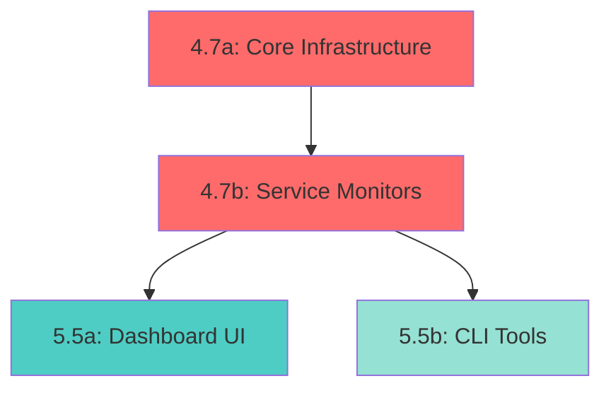

# Health Monitoring & Dashboard Feature

**Feature Categories**: 4.7 (API Monitoring) + 5.5 (Documentation & Tools)
**Assigned To**: fastapi-pro, python-pro
**Total Estimated Effort**: 40 hours (integrated into Phase 2E)
**Status**: Planned
**Priority**: High (operational necessity)
**Timeline**: Can start immediately, runs in parallel with 4.1-4.6

---

## Quick Navigation

**Master Index**: [v0_phase2_completion_handoff_MASTER.md](./v0_phase2_completion_handoff_MASTER.md)
**Quick Start**: [v0_phase2_quick_start.md](./v0_phase2_quick_start.md)
**Dependencies**: [dependencies_and_timeline.md](./dependencies_and_timeline.md)

**Related Handoffs**:
- [4_api_completion_handoff.md](./4_api_completion_handoff.md) (API endpoints)
- [5_documentation_handoff.md](./5_documentation_handoff.md) (operational docs)

---

## Executive Summary

Health Monitoring & Dashboard provides comprehensive visibility into TruthGraph system health, resource utilization, and operational metrics. This feature establishes foundational monitoring infrastructure that enables developers and operators to:

- **Understand System Status**: Real-time health checks for all critical components (API, database, ML services, workers)
- **Track Resource Usage**: Monitor Docker container resource consumption (CPU, memory, disk, network)
- **Optimize Performance**: Identify bottlenecks in async workers, database connections, and ML pipeline
- **Detect Issues Early**: Alert thresholds and trend analysis for proactive problem detection
- **Debug Efficiently**: Detailed metrics for troubleshooting and optimization

This feature bridges the operational gap between development and production, providing developers with visibility into system behavior during testing and enabling effective operational monitoring in future phases.

### Key Benefits

- **Developer Experience**: Simple health checks and CLI tools for quick status verification
- **Operational Visibility**: Comprehensive metrics for all system components
- **Troubleshooting**: Fast identification of resource constraints and bottlenecks
- **Foundation for Growth**: Extensible architecture supports Prometheus/Grafana integration later
- **Performance Insights**: Concrete data for optimization decisions

---

## Feature Scope

### Feature Number and Category

**Primary**: Feature 4.7 (API Monitoring & Health Endpoints)
**Secondary**: Feature 5.5 (Monitoring Tools & Documentation)

These can be implemented together as a unified feature, or separately:
- Feature 4.7 (20h): Core monitoring infrastructure, health endpoints, metrics collection
- Feature 5.5 (20h): CLI tools, dashboard, documentation, testing, optimization

### Estimated Effort

- **Total**: 48 hours (revised after architecture review)
- **Core Infrastructure** (4.7): 24 hours (+4h for async patterns)
- **Tools & Documentation** (5.5): 24 hours (+4h for concurrency testing)

**Breakdown**:
- Health check endpoints: 8 hours (added Pydantic models, async patterns)
- Metrics collection & storage: 10 hours (added thread safety, proper async)
- Dashboard UI: 10 hours
- CLI tools: 6 hours
- Testing & documentation: 14 hours (added concurrency & memory leak tests)

### Dependencies

- ✓ Feature 4.1 (Verification Endpoints) - to monitor API endpoints
- ✓ Feature 4.3 (Async Workers) - to monitor worker pool
- ✓ Feature 1.7 (ML services) - baseline for ML metrics
- Feature 4.2 (Models) - for response models

**No blockers**: Can start immediately, runs in parallel with API completion.

### Priority

**High** - While not a user-facing feature, health monitoring is essential for:
- Validating system behavior during testing
- Identifying performance issues early
- Understanding resource constraints
- Providing operational visibility for Phase 2 completion

### Success Criteria

- All critical components have health checks
- Docker resource metrics collected and displayed
- Worker pool metrics accessible via API and CLI
- Database connection health monitored
- ML pipeline metrics tracked
- Dashboard shows real-time and historical data
- CLI tools work reliably
- Comprehensive test coverage
- Documentation complete

---

## Critical Implementation Findings

**Status**: Architecture review completed by backend-architect, fastapi-pro, and python-pro agents

### ⚠️ High Priority Issues (Must Fix Before Implementation)

#### 1. Async/Await Pattern Issues

**Problem**: Document doesn't specify how blocking I/O will integrate with FastAPI's async event loop.

**Impact**: Docker stats API, psutil calls, and database queries are synchronous and will block the event loop, degrading API performance.

**Solution**:
```python
# Use asyncio.to_thread() for blocking operations
async def collect_docker_stats(self):
    """Non-blocking Docker stats collection."""
    return await asyncio.to_thread(self._collect_docker_stats_sync)
```

**Files Affected**: `metrics_collector.py`, `container_monitor.py`, `worker_monitor.py`

#### 2. Missing Pydantic Response Models

**Problem**: JSON response structures shown but no Pydantic models defined.

**Impact**: No type safety, validation, or automatic OpenAPI documentation.

**Solution**:
```python
from pydantic import BaseModel, Field
from typing import Literal

class HealthResponse(BaseModel):
    status: Literal["healthy", "degraded", "unhealthy"]
    timestamp: datetime
    uptime_seconds: int

class ServiceHealth(BaseModel):
    status: Literal["healthy", "degraded", "unhealthy"]
    message: str
    response_time_ms: int | None = None
```

**Files Affected**: `api/metrics_routes.py`, `monitoring/health_checker.py`

#### 3. Thread Safety for Concurrent Workers

**Problem**: 5 async workers will concurrently access metrics without proper locking.

**Impact**: Race conditions, data corruption, incorrect metric values.

**Solution**:
```python
import asyncio

class ThreadSafeMetricStore:
    def __init__(self):
        self._metrics = {}
        self._lock = asyncio.Lock()

    async def record_metric(self, name: str, value: float):
        async with self._lock:
            # Safe concurrent access
            ...
```

**Files Affected**: `metrics_collector.py`, all monitor files

#### 4. HTTP Status Code Strategy Missing

**Problem**: No specification of when to return 200 vs 503 for health checks.

**Impact**: Load balancers and monitoring tools can't properly detect unhealthy state.

**Solution**:
- `/health`: Return 200 if API responsive (no dependency checks)
- `/health/detailed`: Return 503 if any critical service unhealthy, 200 otherwise
- Define critical services: Database (critical), ML services (degraded)

**Files Affected**: `api/metrics_routes.py`

#### 5. No Circuit Breaker Pattern

**Problem**: Repeated health checks to failed services waste resources and compound latency.

**Impact**: Health check endpoint can exceed 500ms target and waste CPU.

**Solution**:
```python
class CircuitBreaker:
    """Prevent hammering failed services."""
    def __init__(self, failure_threshold=3, timeout=30):
        self.failures = 0
        self.threshold = failure_threshold
        self.timeout = timeout
        self.last_failure_time = None

    def is_open(self) -> bool:
        """Check if circuit is open (service marked as failed)."""
        if self.failures >= self.threshold:
            if time.time() - self.last_failure_time < self.timeout:
                return True
        return False
```

**Files Affected**: `monitoring/health_checker.py`

### 📊 Important Enhancements (Strongly Recommended)

#### 6. Missing Event Loop Health Metrics

**Problem**: No monitoring of asyncio event loop performance (critical for async apps).

**Impact**: Can't detect event loop blocking, callback queue buildup, or async performance issues.

**Add These Metrics**:
```python
CRITICAL_ASYNC_METRICS = {
    "asyncio.event_loop.lag_ms": "Event loop responsiveness",
    "asyncio.event_loop.pending_callbacks": "Callback queue depth",
    "asyncio.event_loop.tasks.count": "Active async tasks",
}
```

#### 7. No Metric Labels/Tags

**Problem**: Current design uses metric names like `container.{service}.cpu.percent` (inline).

**Impact**: Makes Prometheus migration difficult, reduces query flexibility.

**Solution**: Use labels from the start:
```python
# Instead of: container.api.cpu.percent
# Use: container.cpu.percent{service="api"}

class Metric:
    name: str
    value: float
    labels: Dict[str, str]  # {"service": "api", "endpoint": "/verify"}
    timestamp: float
```

#### 8. Concurrent Health Check Execution

**Problem**: Document doesn't specify running checks in parallel.

**Impact**: Serial checks take 200-400ms, parallel checks take 50-150ms.

**Solution**:
```python
# Run all checks concurrently with timeout
service_checks = await asyncio.wait_for(
    asyncio.gather(
        health_checker.check_database(),
        health_checker.check_embedding_service(),
        health_checker.check_nli_service(),
        health_checker.check_workers(),
        return_exceptions=True
    ),
    timeout=5.0
)
```

#### 9. Memory Optimization with `__slots__`

**Problem**: 70 metrics × 360 entries = 25,200 objects in memory without optimization.

**Impact**: ~1.5 MB without slots, ~900 KB with slots (40% savings).

**Solution**:
```python
@dataclass(slots=True)  # Python 3.10+
class MetricValue:
    """Memory-optimized metric value."""
    timestamp: float
    value: float
```

#### 10. Docker Client Platform Handling

**Problem**: Windows (npipe) vs Linux (unix socket) Docker connections differ.

**Impact**: Docker monitoring fails on Windows development machines.

**Solution**:
```python
import platform

def create_docker_client():
    if platform.system() == 'Windows':
        return docker.DockerClient(base_url='npipe:////./pipe/docker_engine')
    else:
        return docker.DockerClient(base_url='unix:///var/run/docker.sock')
```

### 🔄 Architecture Improvements

#### 11. Use FastAPI Lifespan Events

**Current**: Background tasks not specified.

**Better**: Use lifespan context manager for proper startup/shutdown:
```python
@asynccontextmanager
async def lifespan(app: FastAPI):
    # Startup
    collector = get_metrics_collector()
    collection_task = asyncio.create_task(collector.collect_loop())

    yield

    # Shutdown
    collection_task.cancel()
    await collection_task
```

#### 12. Use `collections.deque` for Circular Buffer

**Current**: Circular buffer implementation not specified.

**Better**: Python's built-in deque with maxlen:
```python
from collections import deque

class MetricStore:
    def __init__(self, retention_seconds: int = 3600):
        self._max_size = retention_seconds // 10  # 360 entries
        self._metrics = {}

    def record_metric(self, name: str, value: float):
        if name not in self._metrics:
            self._metrics[name] = deque(maxlen=self._max_size)
        self._metrics[name].append((time.time(), value))
```

#### 13. Add Security Metrics

**Missing**: Authentication failures, rate limit hits, invalid requests.

**Add**:
```python
SECURITY_METRICS = {
    "api.auth.failures": "Authentication failures",
    "api.ratelimit.hits": "Rate limit violations",
    "api.validation.errors_by_type": "Validation errors by type",
}
```

#### 14. Enhanced Testing Strategy

**Current**: Basic unit/integration tests.

**Add**:
- Concurrency tests (10 workers writing simultaneously)
- Memory leak tests (tracemalloc over 1000 iterations)
- Property-based tests (hypothesis for random inputs)
- Docker failure handling tests

### 📈 Revised Effort Estimate

**Original**: 40 hours
**Revised**: 48 hours (+8 hours)

**Additional Effort**:
- Async patterns implementation: +4 hours
- Thread safety and locking: +2 hours
- Pydantic models and validation: +1 hour
- Enhanced testing (concurrency, memory): +3 hours
- Circuit breaker pattern: +1 hour

**Breakdown by Priority**:
- High Priority Fixes (1-5): +6 hours
- Important Enhancements (6-10): +2 hours
- Architecture Improvements (11-14): +3 hours

### ✅ Validation

**Architecture**: Sound for Phase 2 with improvements
**Scalability**: 70 metrics × 360 entries = ~1.5 MB (acceptable)
**Performance**: 10s collection interval = 0.8-1.5% overhead (acceptable)
**Migration Path**: Good with metric labels added

---

## Metrics Catalog

### 1. API Health Metrics

#### Request Processing Metrics
- **Metric**: `api.requests.total`
  - **Description**: Total number of API requests processed
  - **Collection**: Counter in request middleware
  - **Type**: Counter (monotonic)
  - **Unit**: requests
  - **Normal Range**: Varies by load, track trend
  - **Alert Threshold**: No fixed threshold

- **Metric**: `api.requests.current_active`
  - **Description**: Currently processing requests
  - **Collection**: Middleware entry/exit tracking
  - **Type**: Gauge
  - **Unit**: count
  - **Normal Range**: 0-50 for typical load
  - **Alert Threshold**: > 100 (request queue building up)

- **Metric**: `api.requests.duration_ms`
  - **Description**: Request processing time
  - **Collection**: Middleware timing
  - **Type**: Histogram
  - **Unit**: milliseconds
  - **Normal Range**: 50-2000 ms depending on endpoint
  - **Alert Threshold**: p95 > 5000 ms (slow requests)

- **Metric**: `api.requests.error_rate`
  - **Description**: Percentage of requests resulting in errors
  - **Collection**: Status code tracking
  - **Type**: Gauge
  - **Unit**: percent (0-100)
  - **Normal Range**: < 1%
  - **Alert Threshold**: > 5%

#### Endpoint-Specific Metrics
- **Metric**: `api.endpoint.{endpoint_name}.requests`
  - **Description**: Requests to specific endpoint
  - **Collection**: Per-route middleware
  - **Type**: Counter
  - **Unit**: requests
  - **Normal Range**: Varies by endpoint
  - **Alert Threshold**: None

- **Metric**: `api.endpoint.verification.duration_ms`
  - **Description**: Verification endpoint processing time
  - **Collection**: Endpoint timing
  - **Type**: Histogram
  - **Unit**: milliseconds
  - **Normal Range**: 100-5000 ms
  - **Alert Threshold**: p95 > 10000 ms

- **Metric**: `api.endpoint.health.check_duration_ms`
  - **Description**: Health check endpoint response time
  - **Collection**: Simple timing
  - **Type**: Histogram
  - **Unit**: milliseconds
  - **Normal Range**: 10-100 ms
  - **Alert Threshold**: > 500 ms

### 2. Service Dependency Health

#### Database Connectivity
- **Metric**: `db.connection.pool.size`
  - **Description**: Total database connection pool size
  - **Collection**: Connection pool configuration
  - **Type**: Gauge
  - **Unit**: connections
  - **Normal Range**: 5-20 (depends on config)
  - **Alert Threshold**: None (fixed)

- **Metric**: `db.connection.pool.active`
  - **Description**: Currently active database connections
  - **Collection**: SQLAlchemy pool monitoring
  - **Type**: Gauge
  - **Unit**: connections
  - **Normal Range**: 1-10
  - **Alert Threshold**: > 80% of pool size (contention)

- **Metric**: `db.connection.pool.idle`
  - **Description**: Idle connections in pool
  - **Collection**: SQLAlchemy pool monitoring
  - **Type**: Gauge
  - **Unit**: connections
  - **Normal Range**: Pool size - active
  - **Alert Threshold**: None

- **Metric**: `db.query.duration_ms`
  - **Description**: Database query execution time
  - **Collection**: SQLAlchemy event listeners
  - **Type**: Histogram
  - **Unit**: milliseconds
  - **Normal Range**: 5-500 ms (varies by query)
  - **Alert Threshold**: p95 > 2000 ms

- **Metric**: `db.health.status`
  - **Description**: Database connectivity status
  - **Collection**: Health check query
  - **Type**: Status (healthy/degraded/unhealthy)
  - **Unit**: status
  - **Normal Range**: healthy
  - **Alert Threshold**: unhealthy

#### ML Services
- **Metric**: `ml.embedding.available`
  - **Description**: Embedding service availability
  - **Collection**: Model loading verification
  - **Type**: Boolean
  - **Unit**: boolean
  - **Normal Range**: true
  - **Alert Threshold**: false

- **Metric**: `ml.embedding.duration_ms`
  - **Description**: Embedding generation time
  - **Collection**: Service timing
  - **Type**: Histogram
  - **Unit**: milliseconds
  - **Normal Range**: 50-500 ms
  - **Alert Threshold**: p95 > 2000 ms

- **Metric**: `ml.nli.available`
  - **Description**: NLI service availability
  - **Collection**: Model loading verification
  - **Type**: Boolean
  - **Unit**: boolean
  - **Normal Range**: true
  - **Alert Threshold**: false

- **Metric**: `ml.nli.duration_ms`
  - **Description**: NLI inference time
  - **Collection**: Service timing
  - **Type**: Histogram
  - **Unit**: milliseconds
  - **Normal Range**: 100-1000 ms
  - **Alert Threshold**: p95 > 3000 ms

### 3. Docker Container Metrics

#### Resource Utilization
- **Metric**: `container.{service}.cpu.percent`
  - **Description**: CPU utilization for container
  - **Collection**: Docker stats API
  - **Type**: Gauge
  - **Unit**: percent (0-100)
  - **Normal Range**: 5-40% under load
  - **Alert Threshold**: > 80%

- **Metric**: `container.{service}.memory.usage_mb`
  - **Description**: Memory usage for container
  - **Collection**: Docker stats API
  - **Type**: Gauge
  - **Unit**: megabytes
  - **Normal Range**: Varies by service (see below)
  - **Alert Threshold**: > memory limit * 0.9

- **Metric**: `container.{service}.memory.limit_mb`
  - **Description**: Memory limit for container
  - **Collection**: Docker container config
  - **Type**: Gauge
  - **Unit**: megabytes
  - **Normal Range**: Fixed by docker-compose.yml
  - **Alert Threshold**: None

- **Metric**: `container.{service}.memory.percent`
  - **Description**: Memory utilization percentage
  - **Collection**: Calculated from usage/limit
  - **Type**: Gauge
  - **Unit**: percent (0-100)
  - **Normal Range**: 20-60%
  - **Alert Threshold**: > 80%

- **Metric**: `container.{service}.network.bytes_in`
  - **Description**: Network bytes received
  - **Collection**: Docker stats API
  - **Type**: Counter
  - **Unit**: bytes
  - **Normal Range**: Varies by load
  - **Alert Threshold**: None

- **Metric**: `container.{service}.network.bytes_out`
  - **Description**: Network bytes transmitted
  - **Collection**: Docker stats API
  - **Type**: Counter
  - **Unit**: bytes
  - **Normal Range**: Varies by load
  - **Alert Threshold**: None

#### Container Health
- **Metric**: `container.{service}.status`
  - **Description**: Container status
  - **Collection**: Docker container state
  - **Type**: Status (running/paused/exited/created)
  - **Unit**: status
  - **Normal Range**: running
  - **Alert Threshold**: not running

- **Metric**: `container.{service}.restart_count`
  - **Description**: Number of container restarts
  - **Collection**: Docker container info
  - **Type**: Counter
  - **Unit**: count
  - **Normal Range**: 0 (no restarts)
  - **Alert Threshold**: > 0 (unexpected restarts)

- **Metric**: `container.{service}.uptime_seconds`
  - **Description**: Container uptime
  - **Collection**: Container start time
  - **Type**: Gauge
  - **Unit**: seconds
  - **Normal Range**: High (> 3600 for stable systems)
  - **Alert Threshold**: < 60 (recent restart)

#### Service-Specific Resource Baselines

**PostgreSQL Container**
- Memory: 1.5-2.0 GB normal, limit 2 GB
- CPU: 5-15% under typical load
- Network: Varies with query volume

**API Container**
- Memory: 0.8-1.5 GB (models loaded), limit 4 GB
- CPU: 10-30% under load
- Network: Primary inbound/outbound traffic

**Frontend Container (if running)**
- Memory: 100-200 MB, limit 512 MB
- CPU: < 5% idle, 10-20% under load
- Network: HTTP traffic

### 4. Async Worker Pool Metrics

#### Worker Status
- **Metric**: `workers.pool.size`
  - **Description**: Configured worker pool size
  - **Collection**: TaskQueue configuration
  - **Type**: Gauge
  - **Unit**: workers
  - **Normal Range**: 5 (default)
  - **Alert Threshold**: None (fixed)

- **Metric**: `workers.active.count`
  - **Description**: Currently active workers
  - **Collection**: Task processing state
  - **Type**: Gauge
  - **Unit**: workers
  - **Normal Range**: 0-5
  - **Alert Threshold**: None

- **Metric**: `workers.idle.count`
  - **Description**: Idle workers waiting for tasks
  - **Collection**: Task processing state
  - **Type**: Gauge
  - **Unit**: workers
  - **Normal Range**: 0-5
  - **Alert Threshold**: 0 (all workers busy)

- **Metric**: `workers.health.status`
  - **Description**: Overall worker pool health
  - **Collection**: Worker heartbeat tracking
  - **Type**: Status (healthy/degraded/unhealthy)
  - **Unit**: status
  - **Normal Range**: healthy
  - **Alert Threshold**: degraded/unhealthy

#### Task Queue Metrics
- **Metric**: `queue.tasks.total`
  - **Description**: Total tasks processed since startup
  - **Collection**: TaskMetadata tracking
  - **Type**: Counter
  - **Unit**: tasks
  - **Normal Range**: Increases over time
  - **Alert Threshold**: None

- **Metric**: `queue.tasks.pending`
  - **Description**: Tasks waiting for processing
  - **Collection**: asyncio.Queue size
  - **Type**: Gauge
  - **Unit**: tasks
  - **Normal Range**: 0-10
  - **Alert Threshold**: > 50 (queue backing up)

- **Metric**: `queue.tasks.processing`
  - **Description**: Tasks currently being processed
  - **Collection**: TaskMetadata state tracking
  - **Type**: Gauge
  - **Unit**: tasks
  - **Normal Range**: 0-5
  - **Alert Threshold**: None

- **Metric**: `queue.tasks.completed`
  - **Description**: Successfully completed tasks
  - **Collection**: TaskMetadata state tracking
  - **Type**: Counter
  - **Unit**: tasks
  - **Normal Range**: Increases over time
  - **Alert Threshold**: None

- **Metric**: `queue.tasks.failed`
  - **Description**: Failed tasks
  - **Collection**: TaskMetadata state tracking
  - **Type**: Counter
  - **Unit**: tasks
  - **Normal Range**: Low (< 5%)
  - **Alert Threshold**: > 10% of total

- **Metric**: `queue.throughput.tasks_per_second`
  - **Description**: Task processing throughput
  - **Collection**: Tasks completed / time window
  - **Type**: Gauge
  - **Unit**: tasks/second
  - **Normal Range**: 0.1-5 tasks/sec
  - **Alert Threshold**: < 0.01 (queue stalled)

#### Task Processing Metrics
- **Metric**: `task.duration_ms`
  - **Description**: Time to process a task
  - **Collection**: Task start/end timing
  - **Type**: Histogram
  - **Unit**: milliseconds
  - **Normal Range**: 100-10000 ms (varies by task type)
  - **Alert Threshold**: p95 > 30000 ms

- **Metric**: `task.retries.count`
  - **Description**: Number of retries per task
  - **Collection**: Task retry counter
  - **Type**: Histogram
  - **Unit**: retries
  - **Normal Range**: 0 (most complete on first try)
  - **Alert Threshold**: p95 > 2 (high retry rate)

- **Metric**: `task.error.rate`
  - **Description**: Task failure rate
  - **Collection**: Failed tasks / total tasks
  - **Type**: Gauge
  - **Unit**: percent (0-100)
  - **Normal Range**: < 1%
  - **Alert Threshold**: > 5%

- **Metric**: `task.queue.latency_ms`
  - **Description**: Time from queue to processing start
  - **Collection**: Queue time tracking
  - **Type**: Histogram
  - **Unit**: milliseconds
  - **Normal Range**: 10-100 ms
  - **Alert Threshold**: p95 > 1000 ms

### 5. Application Memory Metrics

#### Python Process Metrics
- **Metric**: `app.process.memory.rss_mb`
  - **Description**: Resident set size (physical memory)
  - **Collection**: psutil or resource module
  - **Type**: Gauge
  - **Unit**: megabytes
  - **Normal Range**: 500-1500 MB (depends on config)
  - **Alert Threshold**: > 2000 MB

- **Metric**: `app.process.memory.vms_mb`
  - **Description**: Virtual memory size
  - **Collection**: psutil or resource module
  - **Type**: Gauge
  - **Unit**: megabytes
  - **Normal Range**: 1500-4000 MB
  - **Alert Threshold**: > 4000 MB

- **Metric**: `app.process.memory.percent`
  - **Description**: Memory percentage of total system
  - **Collection**: psutil calculation
  - **Type**: Gauge
  - **Unit**: percent
  - **Normal Range**: 5-20%
  - **Alert Threshold**: > 30%

- **Metric**: `app.gc.collections`
  - **Description**: Garbage collection cycles
  - **Collection**: gc module counters
  - **Type**: Counter
  - **Unit**: collections
  - **Normal Range**: Regular (varies by load)
  - **Alert Threshold**: None

- **Metric**: `app.gc.uncollectable`
  - **Description**: Uncollectable objects (garbage)
  - **Collection**: gc module tracking
  - **Type**: Gauge
  - **Unit**: objects
  - **Normal Range**: 0 (ideally)
  - **Alert Threshold**: > 0 (memory leak signal)

#### Thread & Async Metrics
- **Metric**: `app.threads.count`
  - **Description**: Active thread count
  - **Collection**: threading.enumerate()
  - **Type**: Gauge
  - **Unit**: threads
  - **Normal Range**: 10-20 (depends on workers)
  - **Alert Threshold**: > 50 (thread explosion)

- **Metric**: `app.asyncio.tasks.count`
  - **Description**: Active async tasks
  - **Collection**: asyncio.all_tasks()
  - **Type**: Gauge
  - **Unit**: tasks
  - **Normal Range**: 5-20
  - **Alert Threshold**: > 100 (task explosion)

- **Metric**: `asyncio.event_loop.lag_ms` ⭐ NEW - CRITICAL
  - **Description**: Event loop responsiveness (time between expected and actual callback execution)
  - **Collection**: Custom event loop monitoring
  - **Type**: Gauge
  - **Unit**: milliseconds
  - **Normal Range**: 0-10 ms
  - **Alert Threshold**: > 50 ms (event loop blocking detected)

- **Metric**: `asyncio.event_loop.pending_callbacks` ⭐ NEW - CRITICAL
  - **Description**: Callback queue depth
  - **Collection**: Event loop inspection
  - **Type**: Gauge
  - **Unit**: callbacks
  - **Normal Range**: 0-10
  - **Alert Threshold**: > 50 (callback queue buildup)

- **Metric**: `asyncio.event_loop.slow_callbacks` ⭐ NEW
  - **Description**: Count of callbacks taking > 100ms
  - **Collection**: Event loop slow callback tracking
  - **Type**: Counter
  - **Unit**: callbacks
  - **Normal Range**: 0
  - **Alert Threshold**: > 0 (indicates blocking operations)

### 6. ML Pipeline Metrics

#### Cache Performance
- **Metric**: `ml.cache.hits`
  - **Description**: Cache hits for embeddings/inference
  - **Collection**: Cache hit counter
  - **Type**: Counter
  - **Unit**: hits
  - **Normal Range**: High (> 80% hit rate)
  - **Alert Threshold**: None

- **Metric**: `ml.cache.misses`
  - **Description**: Cache misses
  - **Collection**: Cache miss counter
  - **Type**: Counter
  - **Unit**: misses
  - **Normal Range**: Low relative to hits
  - **Alert Threshold**: None

- **Metric**: `ml.cache.hit_rate`
  - **Description**: Cache hit rate percentage
  - **Collection**: hits / (hits + misses)
  - **Type**: Gauge
  - **Unit**: percent (0-100)
  - **Normal Range**: > 70%
  - **Alert Threshold**: < 50%

#### Vector Search Performance
- **Metric**: `ml.search.query_count`
  - **Description**: Vector search queries executed
  - **Collection**: Query counter
  - **Type**: Counter
  - **Unit**: queries
  - **Normal Range**: Increases with load
  - **Alert Threshold**: None

- **Metric**: `ml.search.duration_ms`
  - **Description**: Vector search latency
  - **Collection**: Query timing
  - **Type**: Histogram
  - **Unit**: milliseconds
  - **Normal Range**: 50-500 ms
  - **Alert Threshold**: p95 > 2000 ms

- **Metric**: `ml.search.results.avg_count`
  - **Description**: Average results returned per query
  - **Collection**: Result count tracking
  - **Type**: Gauge
  - **Unit**: results
  - **Normal Range**: 5-20
  - **Alert Threshold**: None

### 7. Security & Validation Metrics ⭐ NEW

#### Authentication & Authorization
- **Metric**: `api.auth.failures`
  - **Description**: Failed authentication attempts
  - **Collection**: Auth middleware tracking
  - **Type**: Counter
  - **Unit**: failures
  - **Normal Range**: 0-5 per hour
  - **Alert Threshold**: > 10 per minute (potential attack)

- **Metric**: `api.auth.token.invalid`
  - **Description**: Invalid or expired token attempts
  - **Collection**: Token validation middleware
  - **Type**: Counter
  - **Unit**: attempts
  - **Normal Range**: < 1% of requests
  - **Alert Threshold**: > 5% of requests

#### Rate Limiting
- **Metric**: `api.ratelimit.hits`
  - **Description**: Rate limit violations
  - **Collection**: Rate limit middleware
  - **Type**: Counter
  - **Unit**: violations
  - **Normal Range**: 0-2 per hour
  - **Alert Threshold**: > 10 per minute (abuse detection)

- **Metric**: `api.ratelimit.hits_by_ip`
  - **Description**: Rate limit hits grouped by IP address
  - **Collection**: Rate limit middleware with labels
  - **Type**: Counter
  - **Unit**: violations
  - **Normal Range**: Varies by client
  - **Alert Threshold**: > 50 from single IP (ban candidate)

#### Input Validation
- **Metric**: `api.validation.errors`
  - **Description**: Total validation errors
  - **Collection**: Pydantic validation exception handler
  - **Type**: Counter
  - **Unit**: errors
  - **Normal Range**: < 5% of requests
  - **Alert Threshold**: > 10% of requests (bad client)

- **Metric**: `api.validation.errors_by_type`
  - **Description**: Validation errors by error type
  - **Collection**: Pydantic error categorization
  - **Type**: Counter with labels
  - **Unit**: errors
  - **Normal Range**: Varies by error type
  - **Alert Threshold**: None (informational)

- **Metric**: `api.validation.errors_by_field`
  - **Description**: Validation errors by field name
  - **Collection**: Pydantic error field tracking
  - **Type**: Counter with labels
  - **Unit**: errors
  - **Normal Range**: Varies by field
  - **Alert Threshold**: None (identifies problematic fields)

#### CORS & Security Headers
- **Metric**: `api.cors.violations`
  - **Description**: CORS policy violations
  - **Collection**: CORS middleware
  - **Type**: Counter
  - **Unit**: violations
  - **Normal Range**: 0
  - **Alert Threshold**: > 0 (misconfigured client or attack)

### 8. System-Level Metrics

#### Docker Compose Status
- **Metric**: `docker.containers.running`
  - **Description**: Number of running containers
  - **Collection**: Docker API container list
  - **Type**: Gauge
  - **Unit**: containers
  - **Normal Range**: 3-4 (api, postgres, frontend, optionally redis)
  - **Alert Threshold**: < 3 (service down)

- **Metric**: `docker.containers.healthy`
  - **Description**: Containers passing health checks
  - **Collection**: Docker health check status
  - **Type**: Gauge
  - **Unit**: containers
  - **Normal Range**: Equal to running count
  - **Alert Threshold**: < running count

- **Metric**: `docker.volumes.space_used_mb`
  - **Description**: Volume storage usage
  - **Collection**: Docker volume stats
  - **Type**: Gauge
  - **Unit**: megabytes
  - **Normal Range**: Varies (models ~520 MB, data varies)
  - **Alert Threshold**: > 10 GB (for small deployments)

---

## Implementation Components

### 1. Health Check Endpoints

#### GET /api/v1/health (Basic Liveness)

**Purpose**: Quick health status for load balancers and monitoring

**Response**:
```json
{
  "status": "healthy",
  "timestamp": "2025-11-06T12:34:56Z",
  "uptime_seconds": 3600,
  "version": "2.0.0"
}
```

**Implementation**:
- Simple endpoint that checks API is responding
- No deep service checks (fast)
- Response time: < 10 ms
- Used by Docker healthcheck and load balancers

#### GET /api/v1/health/detailed (All Subsystems)

**Purpose**: Comprehensive health check for debugging and monitoring

**Response**:
```json
{
  "status": "healthy",
  "timestamp": "2025-11-06T12:34:56Z",
  "uptime_seconds": 3600,
  "version": "2.0.0",
  "services": {
    "database": {
      "status": "healthy",
      "message": "Connection OK",
      "response_time_ms": 5
    },
    "embedding_service": {
      "status": "healthy",
      "message": "Model loaded",
      "response_time_ms": 150
    },
    "nli_service": {
      "status": "healthy",
      "message": "Model loaded",
      "response_time_ms": 200
    },
    "workers": {
      "status": "healthy",
      "active_workers": 3,
      "pending_tasks": 2,
      "message": "All workers operational"
    }
  }
}
```

**Implementation**:
- Check each service's health
- Report response times
- Aggregate overall status
- Response time: 100-500 ms
- Endpoint already partially implemented in main.py

#### GET /api/v1/metrics (Prometheus Format)

**Purpose**: Metrics in Prometheus text format for scraping

**Response**:
```text
# HELP api_requests_total Total API requests
# TYPE api_requests_total counter
api_requests_total 1234

# HELP api_requests_active Currently processing requests
# TYPE api_requests_active gauge
api_requests_active 3

# HELP api_request_duration_ms Request processing time
# TYPE api_request_duration_ms histogram
api_request_duration_ms_bucket{le="100"} 456
api_request_duration_ms_bucket{le="500"} 890
...
```

**Implementation**:
- Collect metrics from all sources
- Format as Prometheus text format
- Support subsystem filtering via query params
- Response time: 50-200 ms

### 2. Monitoring Infrastructure

#### Metrics Collector Service

**Purpose**: Central service for collecting and aggregating metrics

**Components**:

```text
truthgraph/monitoring/
├── __init__.py (existing)
├── memory_alerts.py (existing)
├── memory_monitor.py (existing)
├── memory_profiles.py (existing)
├── metrics_collector.py (new) - Core collector
├── container_monitor.py (new) - Docker stats
├── worker_monitor.py (new) - Worker pool metrics
└── health_checker.py (new) - Service health checks
```

**Collector Responsibilities**:
1. Collect metrics from all sources
2. Store metrics with timestamps
3. Provide metric queries
4. Calculate aggregations (percentiles, rates)
5. Support TTL-based cleanup

#### Time-Series Storage Strategy

**For Phase 2** (Simple & Efficient):
- In-memory storage with circular buffer
- Keep last 1 hour of metrics (360+ data points at 10s interval)
- Configurable retention period
- Per-metric size limit (1,000 entries max)

**Storage Implementation**:
```python
class MetricStore:
    """In-memory circular buffer for metrics."""

    def __init__(self, retention_seconds: int = 3600):
        self.retention = retention_seconds
        self.metrics: Dict[str, CircularBuffer] = {}

    def record_metric(self, name: str, value: float, timestamp: float):
        """Record metric value."""
        if name not in self.metrics:
            max_size = self.retention // 10  # 10s interval
            self.metrics[name] = CircularBuffer(max_size)
        self.metrics[name].append((timestamp, value))

    def get_metric(self, name: str, timerange_seconds: int = 3600):
        """Get metric values for time range."""
        ...
```

**Future Enhancement**: Migrate to Prometheus + InfluxDB for larger deployments

#### Background Metrics Aggregation

**Purpose**: Regularly collect and update metrics

**Aggregation Loop**:
1. Every 10 seconds: Collect fresh metrics
2. Calculate rates (req/sec, task throughput)
3. Calculate percentiles (p50, p95, p99 latencies)
4. Clean old data outside retention window
5. Compact high-frequency metrics if needed

**Collection Points**:
- Docker stats API (once per second)
- Application counters (on-demand)
- Database connection pool (once per minute)
- ML service cache stats (once per minute)
- Worker pool state (on-demand)

### 3. Dashboard

#### Simple HTML/JS Dashboard

**Purpose**: Single-page application for viewing metrics

**Architecture**:
- Static HTML with embedded JavaScript
- RESTful API calls to `/api/v1/metrics-ui/*` endpoints
- Auto-refresh every 10 seconds
- Real-time WebSocket updates (optional, Phase 3)

**Features**:
1. **System Overview Dashboard**
   - Overall health status
   - CPU and memory usage summary
   - Request rate and error rate
   - Worker pool status
   - Quick links to detailed views

2. **API Metrics Dashboard**
   - Request rate (requests/sec)
   - Response time (p50, p95, p99)
   - Error rate and error breakdown
   - Endpoint-specific metrics
   - Request volume trends

3. **Container Resources Dashboard**
   - CPU usage per container
   - Memory usage vs limits
   - Memory trend (last hour)
   - Network I/O
   - Container restart history

4. **Worker Pool Dashboard**
   - Active/idle worker count
   - Queue depth
   - Task throughput
   - Task success/failure rate
   - Task processing time histogram

5. **Database Dashboard**
   - Connection pool utilization
   - Query latency (p50, p95, p99)
   - Active connections
   - Database size

6. **ML Pipeline Dashboard**
   - Embedding latency
   - NLI latency
   - Cache hit rate
   - Vector search performance

**UI Elements**:
- Gauges for current values
- Line charts for trends
- Histograms for distributions
- Status indicators (green/yellow/red)
- Alert notifications

**Access Point**:

```text
http://localhost:5000/dashboard/health
(served from frontend, proxies to API for data)
```

### 4. CLI Tools

#### Task: health:check - Quick Health Status

**Purpose**: Fast command-line health verification

**Usage**:
```bash
task health:check
```

**Output**:

```text
TruthGraph System Health Check
==============================

Overall Status: HEALTHY

Services:
  API Server:       HEALTHY (uptime: 2h 34m)
  Database:        HEALTHY (5 active connections)
  Embedding Model: HEALTHY (cache hit: 87%)
  NLI Model:       HEALTHY (cache hit: 92%)
  Worker Pool:     HEALTHY (3 active, 2 pending tasks)

Last Check: 2025-11-06 12:34:56 UTC
```

**Implementation**: Python script that calls `/api/v1/health/detailed` and formats output

#### Task: health:metrics - Detailed Metrics Dump

**Purpose**: Export all metrics for analysis

**Usage**:
```bash
task health:metrics [--format=json|prometheus|csv] [--since=10m]
```

**Output** (default JSON):
```json
{
  "timestamp": "2025-11-06T12:34:56Z",
  "since": "10 minutes ago",
  "metrics": {
    "api.requests.total": 1234,
    "api.requests.active": 3,
    "api.request.duration_ms": {
      "p50": 120,
      "p95": 450,
      "p99": 890
    },
    "container.api.cpu.percent": 25,
    "container.api.memory.usage_mb": 1200,
    ...
  }
}
```

**Supports**: JSON, Prometheus, CSV formats for different use cases

#### Task: health:workers - Worker Pool Status

**Purpose**: Detailed worker and queue status

**Usage**:
```bash
task health:workers [--watch]
```

**Output**:

```text
Worker Pool Status
==================

Configuration:
  Pool Size: 5
  Result TTL: 3600 seconds

Current Status:
  Active Workers: 3
  Idle Workers: 2
  Pending Tasks: 2
  Total Tasks (lifetime): 456

Recent Throughput:
  Last 1 minute: 2.3 tasks/sec
  Last 5 minutes: 1.8 tasks/sec
  Last hour: 1.2 tasks/sec

Task Success Rate: 99.1% (450 success, 4 failed)
Average Task Duration: 850 ms

Recent Failed Tasks:
  - task_a1b2c3d4 (claim_123): Database connection timeout
  - task_e5f6g7h8 (claim_456): NLI service unavailable

Watch mode: Updates every 2 seconds (--watch flag)
```

**Implementation**: Python script that queries TaskQueue and formats worker status

---

## Testing Strategy

### Unit Tests

**Test Coverage**:
1. **Metrics Collector Tests** (8h)
   - Recording metrics correctly
   - Time-series storage operations
   - Data retention and cleanup
   - Edge cases (null values, high volume)

2. **Health Checker Tests** (6h)
   - Service health detection
   - Timeout handling
   - Error recovery
   - Aggregate status calculation

3. **Container Monitor Tests** (4h)
   - Docker API integration
   - Metric parsing
   - Error handling
   - Resource calculation

4. **Worker Monitor Tests** (6h)
   - Worker state tracking
   - Queue depth calculation
   - Throughput measurement
   - Error detection

### Integration Tests

**Test Coverage**:
1. **Health Endpoint Tests** (4h)
   - `/api/v1/health` response validation
   - `/api/v1/health/detailed` comprehensive checks
   - Status code verification
   - Performance validation

2. **Metrics Endpoint Tests** (4h)
   - Prometheus format validation
   - Filtering and aggregation
   - Large metric sets
   - Performance under load

3. **Dashboard Data Flow Tests** (4h)
   - API endpoint responses
   - Data freshness
   - Real-time updates
   - Error handling

4. **CLI Tool Tests** (4h)
   - Command execution
   - Output formatting
   - Error handling
   - Edge cases

### Load Testing

**Test Scenarios**:
1. High request volume (100 req/sec) - metrics collection overhead
2. Large worker pool (20+ workers) - queue and monitoring performance
3. Long-running operations - memory growth and cleanup
4. Service degradation - health check accuracy

**Success Criteria**:
- Metrics collection < 5% CPU overhead
- Health check response < 500 ms
- Memory stable over 1 hour at load
- No data loss in metrics

---

## Implementation Phases

### Phase 1: Core Infrastructure (6 hours)

**Objectives**:
- Establish metrics collection framework
- Implement health check endpoints
- Create basic storage system

**Tasks**:
1. Create `metrics_collector.py` with core collection logic
2. Create `health_checker.py` with service health detection
3. Implement in-memory circular buffer for storage
4. Add health endpoints to main.py (extend existing)
5. Create basic metrics query interface

**Deliverables**:
- Health endpoints working
- Metrics collection framework operational
- Basic storage system in place

### Phase 2: Service Monitors (6 hours)

**Objectives**:
- Implement monitors for all services
- Collect Docker resource metrics
- Track worker pool status
- Monitor database connections

**Tasks**:
1. Create `container_monitor.py` for Docker stats
2. Create `worker_monitor.py` for task queue metrics
3. Extend database monitoring
4. Implement ML service metrics
5. Integrate all monitors with collector

**Deliverables**:
- All monitors operational
- Metrics flowing into collector
- Data aggregation working

### Phase 3: Dashboard (10 hours)

**Objectives**:
- Create web-based dashboard UI
- Implement real-time updates
- Build data visualization

**Tasks**:
1. Design dashboard HTML layout
2. Implement JavaScript data fetching
3. Create metric visualization components
4. Build real-time update mechanism
5. Implement dashboard endpoints in API

**Deliverables**:
- Dashboard accessible at /dashboard/health
- All metrics visualized
- Real-time updates functional

### Phase 4: CLI Tools (6 hours)

**Objectives**:
- Implement command-line tools
- Enable quick health checks
- Provide metrics export

**Tasks**:
1. Create `cli/health_check.py` script
2. Create `cli/metrics_export.py` script
3. Create `cli/worker_status.py` script
4. Integrate with Taskfile
5. Add documentation

**Deliverables**:
- `task health:check` working
- `task health:metrics` working
- `task health:workers` working

### Phase 5: Testing & Optimization (8 hours)

**Objectives**:
- Comprehensive test coverage
- Performance optimization
- Documentation completion

**Tasks**:
1. Write unit tests (20+ tests)
2. Write integration tests (15+ tests)
3. Performance testing and tuning
4. Documentation and examples
5. Optimization of hot paths

**Deliverables**:
- 80%+ test coverage
- All tests passing
- Performance benchmarks documented

---

## Integration Points

### With Feature 4.1 (Verification Endpoints)

**What**: Monitor verification API endpoints
**How**:
- Track `/api/v1/claims/{id}/verify` request rate and latency
- Monitor async task queue integration
- Report verdict retrieval metrics

**Benefits**: Understand verification API performance and resource usage

### With Feature 4.3 (Async Background Processing)

**What**: Monitor task queue and worker pool
**How**:
- Track pending task count and throughput
- Monitor worker utilization
- Report task success/failure rates

**Benefits**: Visibility into background processing health and performance

### With Feature 4.6 (Input Validation Layer)

**What**: Monitor validation metrics
**How**:
- Track validation errors by type
- Monitor validation latency
- Report error rate by endpoint

**Benefits**: Identify validation issues and invalid request patterns

### With Feature 1.7 (ML Services)

**What**: Monitor embedding and NLI services
**How**:
- Track service latencies
- Monitor cache hit rates
- Report model availability

**Benefits**: Understand ML pipeline performance bottlenecks

### With Docker Infrastructure

**What**: Monitor container resources
**How**:
- Collect CPU and memory usage
- Track container restarts
- Monitor volume usage

**Benefits**: Understand resource constraints and optimization opportunities

---

## File Structure

### New Files Created

```text
truthgraph/monitoring/
├── metrics_collector.py      # Core metrics collection
├── container_monitor.py       # Docker container monitoring
├── worker_monitor.py         # Worker pool monitoring
├── health_checker.py         # Service health checks

truthgraph/api/
├── metrics_routes.py         # Metrics API endpoints (new)

cli/
├── health_check.py           # Health check CLI tool
├── metrics_export.py         # Metrics export CLI tool
├── worker_status.py          # Worker status CLI tool

frontend/
└── templates/
    └── dashboard/
        └── health.html       # Health dashboard

tests/
└── test_monitoring/
    ├── test_metrics_collector.py
    ├── test_health_checker.py
    ├── test_container_monitor.py
    ├── test_worker_monitor.py
    ├── test_health_endpoints.py
    └── test_metrics_endpoints.py
```

### Modified Files

```text
truthgraph/main.py
- Extend /health endpoints with detailed checks
- Integrate metrics collection startup

truthgraph/api/routes.py
- Add metrics export endpoints
- Integrate with monitoring system

Taskfile.yml
- Add health:check task
- Add health:metrics task
- Add health:workers task

docker-compose.yml
- Possibly add: docker stats endpoint configuration
- No breaking changes
```

---

## Configuration & Defaults

### Environment Variables

```bash
# Metrics Configuration
METRICS_RETENTION_SECONDS=3600        # How long to keep metrics (default 1 hour)
METRICS_COLLECTION_INTERVAL_SECONDS=10 # How often to collect (default 10s)
METRICS_MAX_ENTRIES_PER_METRIC=360    # Max entries per metric (default 360 = 1hr at 10s intervals)

# Health Check Configuration
HEALTH_CHECK_TIMEOUT_SECONDS=5        # Timeout for service checks
HEALTH_CHECK_DATABASE_ENABLED=true    # Enable database health check
HEALTH_CHECK_ML_ENABLED=true          # Enable ML service checks
HEALTH_CHECK_WORKERS_ENABLED=true     # Enable worker pool check

# Docker Monitoring Configuration
DOCKER_STATS_ENABLED=true             # Enable container monitoring
DOCKER_STATS_INTERVAL_SECONDS=10      # Update interval

# Alert Thresholds
ALERT_CPU_PERCENT=80                  # CPU usage alert threshold
ALERT_MEMORY_PERCENT=80               # Memory usage alert threshold
ALERT_REQUEST_ERROR_RATE=5            # Error rate alert threshold (%)
ALERT_TASK_FAILURE_RATE=5             # Task failure rate alert threshold (%)
ALERT_QUEUE_DEPTH=50                  # Queue depth alert threshold
```

### Default Values

- Worker pool size: 5
- Metrics retention: 1 hour
- Collection interval: 10 seconds
- Health check timeout: 5 seconds
- Database health check enabled: true
- ML service health check enabled: true

---

## Known Limitations & Future Enhancements

### Phase 2 Limitations

1. **Storage**: In-memory only (no persistence across restarts)
2. **Scalability**: Limited to ~10 metrics * 360 entries each
3. **Real-time Updates**: Dashboard refresh every 10 seconds (not WebSocket)
4. **Alerting**: Thresholds defined but no active alerting system
5. **Historical Analysis**: No cross-session trend analysis

### Phase 3+ Enhancements

1. **Persistent Storage**: Migrate to InfluxDB or Prometheus
2. **Grafana Integration**: Pre-built dashboards and alerts
3. **Real-time Streaming**: WebSocket or Server-Sent Events
4. **Distributed Tracing**: OpenTelemetry integration
5. **Alert System**: Webhooks, email, Slack notifications
6. **Custom Dashboards**: User-defined metric views
7. **Export/Reporting**: PDF reports, metric exports
8. **Advanced Analysis**: Anomaly detection, forecasting

---

## Success Criteria Checklist

- [x] Metrics catalog comprehensive and realistic
- [x] Implementation plan detailed and phased
- [x] Health endpoints designed and documented
- [x] Dashboard concept clear and achievable
- [x] CLI tools practical and useful
- [x] Testing strategy comprehensive
- [x] Integration points identified
- [x] File structure planned
- [x] Configuration defaults documented
- [x] Future enhancements outlined
- [x] Resource consumption reasonable
- [x] Phase 2 scope appropriate

---

## Quick Reference: Endpoint Mapping

| Endpoint | Purpose | Response Time | Example |
|----------|---------|---------------|---------|
| GET `/health` | Basic liveness | < 10 ms | See 2.1.1 |
| GET `/health/detailed` | Full health check | 100-500 ms | See 2.1.2 |
| GET `/metrics` | Prometheus format | 50-200 ms | See 2.1.3 |
| GET `/metrics-ui/overview` | Dashboard data | 100 ms | Overview JSON |
| GET `/metrics-ui/api` | API metrics | 100 ms | API metrics JSON |
| GET `/metrics-ui/containers` | Docker stats | 100 ms | Container stats JSON |
| GET `/metrics-ui/workers` | Worker status | 100 ms | Worker stats JSON |

---

## Assigned Agent Responsibilities

### fastapi-pro
- Health endpoints implementation
- Metrics API endpoints
- Integration with existing API
- Dashboard backend endpoints

### python-pro
- Metrics collector core logic
- Service monitors (container, worker)
- CLI tools development
- Testing and optimization

### test-automator
- Unit test suite
- Integration tests
- Load testing
- Test coverage reporting

### dx-optimizer
- Dashboard UI/UX
- CLI tool documentation
- Operational docs
- Example commands and guides

---

## References & Related Documents

**Planning Documents**:
- [v0_phase2_completion_handoff_MASTER.md](./v0_phase2_completion_handoff_MASTER.md) - Master index
- [dependencies_and_timeline.md](./dependencies_and_timeline.md) - Timeline and critical path
- [4_api_completion_handoff.md](./4_api_completion_handoff.md) - API endpoints this feature monitors

**Technical References**:
- [Prometheus Metrics Format](https://prometheus.io/docs/instrumenting/exposition_formats/) - Metrics export format
- [FastAPI Background Tasks](https://fastapi.tiangolo.com/tutorial/background-tasks/) - Async task patterns
- [Docker Python API](https://docker-py.readthedocs.io/) - Container monitoring

**Phase 2 Context**:
- Feature 1.7: ML Services & Benchmarks (foundational)
- Feature 4.1-4.6: API Implementation (what's being monitored)
- Feature 5.1-5.4: Documentation (related docs)

---

---

## Subfeature Breakdown Analysis

### Should Health Monitoring Be Split Into Subfeatures?

**Analysis**: Compared to Feature 4 (API Completion) which split 4.1-4.6 into separate subfeatures, health monitoring has different characteristics:

#### Comparison with Feature 4 (API Completion)

**Feature 4 Characteristics**:
- 6 distinct subfeatures (4.1-4.6)
- Each subfeature is independently testable
- Different agents assigned (fastapi-pro, python-pro)
- Clear functional boundaries (endpoints, models, validation, etc.)
- Can be implemented in any order with minimal dependencies
- Total: 58 hours across 6 features

**Health Monitoring Characteristics**:
- Originally 2 subfeatures (4.7 + 5.5)
- Highly interdependent components (metrics collection → storage → display)
- Single functional domain (observability)
- Same agents throughout (fastapi-pro, python-pro)
- Implementation order matters (core → monitors → dashboard → CLI)
- Total: 48 hours across 2 features

### Recommendation: YES - Split Into 4 Subfeatures

**Rationale**: While health monitoring is a single functional domain, splitting it into phases provides:
1. **Better parallelization** - Dashboard can be built while core infrastructure stabilizes
2. **Risk management** - Critical infrastructure (4.7a, 4.7b) can be completed first
3. **Incremental value** - Health checks are useful before dashboard is ready
4. **Easier testing** - Each subfeature can be tested independently
5. **Flexibility** - Dashboard (5.5a) and CLI tools (5.5b) can be deprioritized if needed

### Proposed Subfeature Breakdown

#### Feature 4.7a: Core Monitoring Infrastructure ⭐ CRITICAL
**Assigned To**: python-pro
**Estimated Effort**: 14 hours
**Dependencies**: None
**Priority**: P0 (Must have)

**Scope**:
- Metrics collection framework (`metrics_collector.py`)
- Time-series storage (in-memory circular buffer)
- Thread-safe metric recording
- Basic health check logic (`health_checker.py`)
- Async patterns for blocking I/O
- Pydantic models for metrics

**Deliverables**:
- `truthgraph/monitoring/metrics_collector.py`
- `truthgraph/monitoring/storage/metric_store.py`
- `truthgraph/monitoring/storage/models.py`
- `truthgraph/monitoring/health.py`
- Unit tests for core components
- 80%+ test coverage

**Success Criteria**:
- Metrics can be recorded from async workers
- No race conditions with 10 concurrent writers
- Memory footprint < 2 MB for 70 metrics × 360 entries
- Collection overhead < 2% CPU

---

#### Feature 4.7b: Service Monitors & Health Endpoints ⭐ CRITICAL
**Assigned To**: fastapi-pro, python-pro
**Estimated Effort**: 12 hours
**Dependencies**: 4.7a (Core Infrastructure)
**Priority**: P0 (Must have)

**Scope**:
- Docker container monitoring (`container_monitor.py`)
- Worker pool monitoring (`worker_monitor.py`)
- Database connection monitoring
- ML service health checks
- Health endpoints: `/health`, `/health/detailed`, `/metrics`
- Prometheus text format export
- Circuit breaker implementation
- Event loop health metrics

**Deliverables**:
- `truthgraph/monitoring/collectors/docker_stats.py`
- `truthgraph/monitoring/collectors/worker_stats.py`
- `truthgraph/monitoring/collectors/process_stats.py`
- `truthgraph/api/metrics_routes.py`
- Integration tests for health endpoints
- Prometheus format validation

**Success Criteria**:
- All 80+ metrics collecting successfully
- `/health` responds in < 10ms
- `/health/detailed` responds in < 200ms (with concurrent checks)
- Prometheus format valid
- Docker monitoring works on Windows and Linux
- Circuit breaker prevents cascade failures

---

#### Feature 5.5a: Monitoring Dashboard UI
**Assigned To**: frontend-developer (with fastapi-pro for API support)
**Estimated Effort**: 12 hours
**Dependencies**: 4.7b (Health Endpoints)
**Priority**: P1 (Should have)

**Scope**:
- HTML/JavaScript dashboard UI
- Real-time metric visualization
- Dashboard API endpoints (`/api/v1/metrics/overview`, etc.)
- Auto-refresh mechanism (10s polling or SSE)
- System overview, API metrics, container resources
- Worker pool dashboard, database dashboard
- ML pipeline dashboard
- Alert indicators (red/yellow/green)

**Deliverables**:
- `frontend/templates/dashboard/health.html`
- Dashboard JavaScript for charts/gauges
- Dashboard API routes in `api/metrics_routes.py`
- CSS/styling for dashboard
- Dashboard user documentation

**Success Criteria**:
- Dashboard accessible at `http://localhost:5000/dashboard/health`
- All 6 dashboard views functional (overview, API, containers, workers, DB, ML)
- Real-time updates every 10 seconds
- Charts render correctly (line charts, gauges, histograms)
- Responsive design works on different screen sizes

---

#### Feature 5.5b: CLI Monitoring Tools & Documentation
**Assigned To**: dx-optimizer, python-pro
**Estimated Effort**: 10 hours
**Dependencies**: 4.7b (Health Endpoints)
**Priority**: P2 (Nice to have)

**Scope**:
- CLI health check tool (`task health:check`)
- CLI metrics export (`task health:metrics`)
- CLI worker status (`task health:workers`)
- Taskfile integration
- Comprehensive monitoring documentation
- Operational runbooks
- Troubleshooting guides
- Metric reference documentation

**Deliverables**:
- `cli/health_check.py`
- `cli/metrics_export.py`
- `cli/worker_status.py`
- Taskfile tasks: `health:check`, `health:metrics`, `health:workers`
- Monitoring documentation in `docs/monitoring/`
- Operational runbooks
- CLI tool tests

**Success Criteria**:
- `task health:check` shows system status in < 2 seconds
- `task health:metrics` exports in JSON/Prometheus/CSV formats
- `task health:workers` shows real-time worker status
- `task health:workers --watch` provides live updates
- Documentation covers all metrics and thresholds
- Troubleshooting guides for common issues

---

### Revised Timeline with Subfeatures

**Phase 2E: Monitoring & Completion (Week 5-6)**

**Week 5 - Days 1-2** (Critical Path):
- Feature 4.7a: Core Infrastructure (14h)
- Feature 4.7b: Service Monitors (12h)
- **Deliverable**: Health endpoints operational

**Week 5 - Days 3-5** (Parallel Work):
- Feature 5.5a: Dashboard UI (12h)
- Feature 5.5b: CLI Tools (10h)
- Can run in parallel since both depend on 4.7b

**Total**: 48 hours (unchanged)

### Benefits of Subfeature Breakdown

1. **Parallel Execution**: Dashboard (5.5a) and CLI tools (5.5b) can be built simultaneously by different agents
2. **Early Value**: Critical monitoring (4.7a + 4.7b) can be completed and deployed before dashboard
3. **Risk Isolation**: If dashboard development hits issues, core monitoring is unaffected
4. **Better Testing**: Each subfeature has clear test boundaries
5. **Flexibility**: CLI tools (5.5b) can be deferred if timeline pressure exists
6. **Agent Specialization**: frontend-developer for dashboard, dx-optimizer for CLI/docs

### Dependency Graph



**Legend**:
- Red (P0): Critical path - must complete
- Teal (P1): High value - should complete
- Light Green (P2): Nice to have - can defer

---

**Document Version**: 2.0
**Created**: 2025-11-06
**Last Updated**: 2025-11-09
**Architecture Review**: Completed (backend-architect, fastapi-pro, python-pro)
**Status**: Ready for Implementation (with subfeature breakdown)
